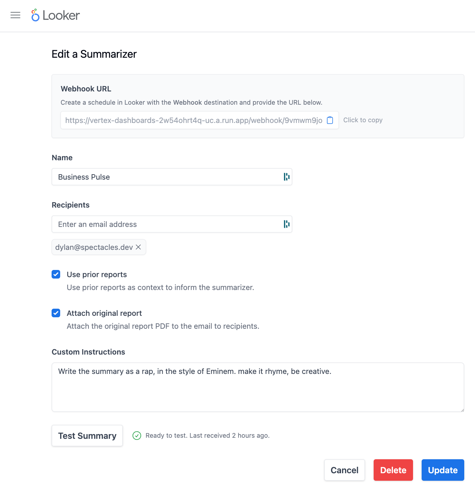
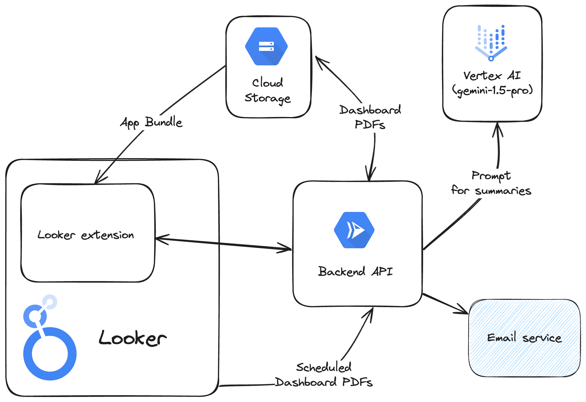

# tl;dd

*tl;dd was created by the team at [Spectacles](https://spectacles.dev) for the Looker Vertex AI Hackathon in June 2024.*

tl;dd (too long, didn't dashboard) is a Looker application (extension) that creates AI summarizers for Looker dashboards that send scheduled emails to recipients in your organization.



These emails are just like the ones sent from Looker schedules, but include a bulleted text summary in the body of the email that looks like this:

### Example tl;dd email

#### Key Insights

 - **Sales are up, but growth is flat:** Total sales continue to climb year-over-year, but the growth rate is consistent with the previous period.
 - **Orders are also up, but holding steady:** Orders are up 47% year-over-year, maintaining the same growth as the last report.
 - **Gender split is basically the same:** 73% of customers are female vs 74% male, which is practically identical to the last report. Our target audience appears to be consistent.
 - **Repeat purchases are still nonexistent:** The repeat purchase rate remains at 0.0%. We need to develop strategies to encourage customers to return.
 - **Website conversions are stuck:** While the dashboard does not show the specific conversion rate, it highlights that it has remained stagnant and suggests focusing on optimizing for conversions.

#### Questions to Explore

 - What can we do to accelerate sales growth?
 - How can we incentivize repeat purchases and build customer loyalty?
 - Are there untapped opportunities to reach a wider audience beyond our core demographic?
 - What specific actions can be taken to improve website conversion rates?
 - How effective are our current marketing campaigns and where can we optimize for better results?

## Add tl;dd to your Looker instance

tl;dd is a Looker extension with an external API. You'll need to deploy the application in your GCP account, then update the manifest file in your Looker project to point to the deployed application.

### Deploy the backend on GCP

tl;dd relies on a backend API deployed as a Cloud Run service with Cloud Firestore as a database.

The easiest way to deploy the backend is using GitHub Actions. You can do so using the following instructions:

#### 1. Fork the repository

To fork the repository, follow these steps:

1. Go to the GitHub page of the repository you want to fork.
2. In the top-right corner of the page, click the "Fork" button. This will create a copy of the repository under your GitHub account.
3. Once the forking process is complete, you will be redirected to your newly forked repository.

####  2. Create a new GCP project

We recommend using a new GCP project for tldd. You can do so by following these steps:

1. Go to the [GCP Console](https://console.cloud.google.com/).
2. Click "Create Project".
3. Fill in the project name and description, then click "Create".

#### 3. Create a new GCP service account

To create a new service account with the Editor permission and generate a JSON key for it, follow these steps:

1. Go to the [GCP Console](https://console.cloud.google.com/).
2. In the left-hand navigation menu, click on "IAM & Admin" and then select "Service Accounts".
3. Click the "Create Service Account" button at the top of the page.
4. Fill in the "Service account name" and "Service account description" fields, then click "Create".
5. In the "Service account permissions" step, select the "Editor" role from the dropdown menu, then click "Continue".
6. In the "Grant users access to this service account" step, you can skip this step by clicking "Done".
7. You will be redirected to the "Service Accounts" page. Find the service account you just created in the list and click on the three vertical dots on the right side of the row, then select "Manage keys".
8. Click the "Add Key" button, then select "Create new key".
9. In the "Key type" section, select "JSON" and then click "Create". This will download a JSON file containing your service account key.
10. Save this JSON file securely, as you will need it to authenticate your GitHub Actions and Terraform configurations.

#### 4. Sign up for Resend

To send summary emails, you need to sign up for a Resend account and obtain an API key. Follow these steps:

1. Go to the [Resend website](https://resend.com/) and sign up for an account.
2. Once you have signed up, navigate to the API section of your Resend dashboard.
3. Follow the instructions provided by Resend to authenticate and generate an API key.
4. Save the API key securely, as you will need it to configure your GitHub Actions and Terraform configurations.

#### 5. Set GitHub Action secrets and variables

To set up the necessary secrets and variables for GitHub Actions, follow these steps:

1. Go to your forked repository on GitHub.
2. Click on the "Settings" tab.
3. In the left-hand menu, click on "Secrets and variables" and then select "Actions".
4. Click the "New repository secret" button to add the following secrets:
   - `GCP_SA_KEY`: Paste the contents of the JSON file you downloaded when creating the GCP service account.
   - `RESEND_API_KEY`: Paste the API key you obtained from Resend.

5. Click the "New repository variable" button to add the following variables:
   - `GCP_PROJECT_ID`: Enter the ID of your GCP project.
   - `GCP_REGION`: Enter the region where you want to deploy your resources (e.g., `us-central1`).
   - `GCP_PDF_BUCKET`: Enter the name of the Google Cloud Storage bucket to store the PDFs.

Once you have added these secrets and variables, your GitHub Actions will be able to access them during the deployment process.

#### 6. Create GCS bucket and update the Terraform state bucket name in `main.tf`

To create a Google Cloud Storage (GCS) bucket and update the Terraform state bucket name in `main.tf`, follow these steps:

1. Go to the [Google Cloud Console](https://console.cloud.google.com/).
2. In the left-hand navigation menu, click on "Storage" and then select "Browser".
3. Click the "Create bucket" button at the top of the page.
4. Fill in the "Name" field with your desired bucket name (e.g., `{gcp_project_name}_tf_state`), and configure the remaining settings as needed. Then click "Create".

Next, update the Terraform state bucket name in `main.tf`:

1. Go to your forked repository on GitHub.
2. Click on the "Code" tab and navigate to the `terraform` directory.
3. Open the `main.tf` file.
4. Update the `bucket` attribute in the `terraform` block to use the newly created bucket name:
   ```hcl
   terraform {
     backend "gcs" {
       bucket = "{gcp_project_name}_tf_state"
       prefix = "tldd"
     }
   }
   ```
5. Commit and push the changes to your repository.

#### 7. Enable the necessary GCP APIs:

To enable the required Google Cloud Platform APIs, follow these steps:

1. Go to the [Google Cloud Console](https://console.cloud.google.com/).
2. In the left-hand navigation menu, click on "APIs & Services" and then select "Library".
3. Use the search bar to find each of the following APIs and enable them:
   - Cloud Run Admin API
   - Cloud Firestore API
   - Artifact Registry API
   - Secret Manager API
   - Vertex AI API
   - Cloud SQL Admin API
   - Cloud Resource Manager API
   - Compute Engine API
   - Cloud Logging API

#### 8. GitHub Actions deployment

Once you commit and push the changes to your repository, GitHub Actions will automatically run the workflow. This will handle the deployment of all necessary services, including setting up the Google Cloud Storage bucket, configuring Terraform, building and pushing the Docker image, and applying the Terraform configurations. The entire process is automated to ensure that your services are deployed seamlessly.


### Set up the application in Looker

1. **Create a new project in Looker:**
   - Go to your Looker instance.
   - Navigate to the "Develop" tab and select "Manage LookML Projects".
   - Click on "New LookML Project" and give your project a name (e.g., `tldd_project`).
   - Click "Create Project".

2. **Set up a LookML model file with any connection:**
   - In your new project, create a new model file. You can call this model whatever you want.
   - Add the following content to the file, replacing `your_connection_name` with any valid connection name in your Looker instance:
     ```lookml
     connection: "your_connection_name"
     ```

3. **Create a `manifest.lkml` file:**
   - In your new project, create a new file named `manifest.lkml`.
   - Add the following content to the file:
     ```lookml
     application: tldd {
       label: "tldd"
       url: "https://storage.googleapis.com/{{ pdf_bucket }}/bundle.js" # replace {{ pdf_bucket }} with the name of your GCS bucket
       entitlements: {
         use_clipboard: yes
         use_form_submit: yes
         # Find the Cloud Run URL in GCP Console, then add it here
         external_api_urls: ["https://vertex-dashboards-2w54ohrt4q-uc.a.run.app"]
         global_user_attributes: ["tldd_api"]
       }
     }
     ```

4. **Set up a `tldd_api` user attribute in Looker:**
   - Go to the "Admin" section of your Looker instance.
   - Navigate to "User Attributes".
   - Click on "New User Attribute".
   - Set the name to `tldd_api`.
   - Set the default value to the Cloud Run URL of your deployed backend.
   - Click "Save".

## Application stack



tl;dd is composed of a **React** frontend, styled with **Tailwind CSS**. It uses the **Looker Extension SDK** to copy to clipboard and submit forms to the backend API.

The backend API is a **FastAPI** (Python) application run on **Cloud Run** with a **Cloud Firestore** document-storage database. The backend API communicates with the `gemini-pro-1.5` model on **Vertex AI** to generate summaries.

Received documents from Looker are stored in **Google Cloud Storage**, which is also used as a basic CDN for serving the frontend JavaScript bundle.

You can configure any email service like Sendgrid or Mailgun to send the summary emails. We've opted to use **[Resend](https://resend.com/)**.

## Future development

The tl;dd API is a public API and does not yet implement authentication. This is a security risk because anyone who knows the URL of the API and an ID of a summarizer can generate summaries for all dashboards that summarizer has received.

Our first priority for future development is to resolve this by implementing a shared secret between the Looker application and the backend API.